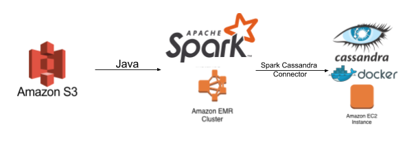
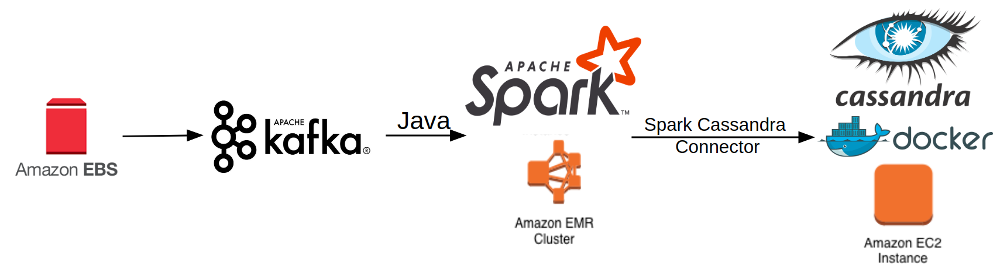

# Batch Processing vs. Streaming Processing

This project is to familiarize myself with cloud computing systems for both batch processing and streaming processing.

The original [transportation dataset](https://aws.amazon.com/datasets/transportation-databases/) is from the US Bureau of Transportation Statistics (BTS) that is hosted as an Amazon EBS volume snapshot (snap-e1608d88 for Linux/Unix and snap-37668b5e for Windows, in the us-east-1 (N. Virginia) region).

## Original Data

[Restore EBS volume](https://docs.aws.amazon.com/AWSEC2/latest/UserGuide/ebs-creating-volume.html#ebs-create-volume-from-snapshot)

After attaching an EBS volume to an EC2 instance, connect to your instance using SSH.
* `lsblk` to view available disk devices and their mount points (if applicable). The output of `lsblk` removes the `/dev/` prefix from full device paths.
* `sudo file -s /dev/xvdf` to determine whether there is a file system on the volume.
* If there is a file system on the volume: use `sudo mkdir /data` and `sudo mount /dev/xvdf /data` to mount the volume to your desired path.

The project only used the flight data in the directory `/aviation/airline_ontime/`, which includes the flight data from 1988 to 2008, 240 files in total with some months unavailable.

## Batch Processing (Spark)

The batch processing system fetches clean data stored in either HDFS or Amazon S3 (Simple Storage Service), computes on a Spark
cluster set up on Amazon EMR (Elastic MapReduce), and finally writes the results into Cassandra which is
installed in a Docker container on an Amazon EC2 (Elastic Compute Cloud) instance.

SSH into the master node of the Spark cluster and run the following script:

`spark-submit --deploy-mode client --class batch.SparkBatch path_to_jar_file`

## Streaming Processing (Spark Streaming)

The streaming processing system includes a Kafka cluster with 3 `m5.large` instances on Amazon MSK (Managed Streaming for Apache Kafka) and a Spark cluster with 3 `m5.xlarge` instances on Amazon Amazon EMR (Elastic MapReduce). The clean data is stored in an Amazon EBS (Elastic Block Store) volume which is mounted to the master node of the Spark cluster, where both my Kafka Producer application and **Spark Streaming** application (the Kafka consumer) are run. All the results are saved into Cassandra which is installed in a Docker container on an Amazon EC2 (Elastic Compute Cloud) instance.

SSH into the master node of the Spark cluster and run the following scripts:

`java -cp path_to_jar_file kafka.ConcurrentProducer`

`spark-submit --deploy-mode client --class streaming.SparkStreaming path_to_jar_file`